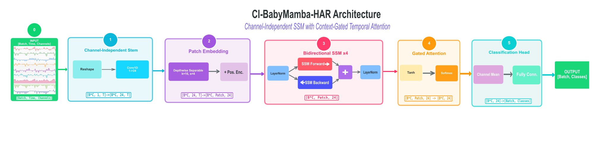
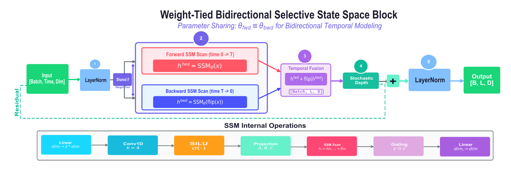
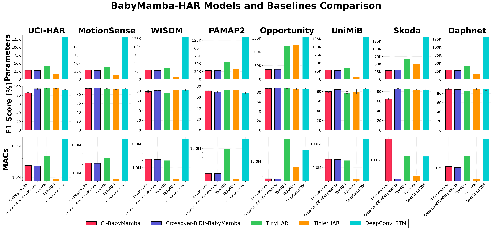

# BabyMamba-HAR:

## Ultra-Lightweight State Space Models for Human Activity Recognition:

**Author:** Mridankan Mandal.

**Paper:** [BabyMamba-HAR: Ultra-Lightweight State Space Models for Human Activity Recognition](https://arxiv.org/abs/2602.09872v1).

**Repository:** [https://github.com/WhiteMetagross/BabyMambaHAR](https://github.com/WhiteMetagross/BabyMambaHAR).

## Overview:

BabyMamba-HAR is presented as a compact state space modeling framework for human activity recognition under severe edge constraints. Two lightweight recurrent architectures are provided in this repository. A channel-independent variant is included for higher-capacity temporal reasoning, and a crossover bidirectional variant is included for lower-latency deployment. The training workflow, export tooling, device-ready model bundles, and measured Raspberry Pi Pico 2 deployment results are all preserved in this release.

The repository is organized so that a paper-aligned retraining pass can be reproduced, checkpoints can be exported into embedded C headers, and the handcrafted recurrent engine can be compiled for microcontroller targets without ONNX or TFLite. The committed artifact layout was designed so that the repository remains usable even when the original training workspace is not present.



*Figure 1. The CI-BabyMamba-HAR architecture used for the channel-independent variant.*

## Model Families:

Two BabyMamba families are included.

- `CiBabyMambaHar` is the channel-independent model family described in the paper. A seed-29 retraining set is provided for all datasets.
- `CrossoverBiDirBabyMambaHar` is the weight-tied bidirectional crossover family. The validated dataset-specific checkpoints used in the edge study are provided.

The architectural intent may be summarized as follows.

- The state space recurrence is kept linear in sequence length.
- Bidirectional temporal context is recovered through a weight-tied forward and reverse scan.
- Device inference is executed through handcrafted C++ recurrence code rather than a graph compiler path.



*Figure 2. The shared bidirectional state space block used by the BabyMamba variants.*

## Repository Contents:

The main repository sections are listed below.

- `ciBabyMambaHar/`. Source code for the channel-independent BabyMamba model family.
- `crossoverBiDirBabyMambaHar/`. Source code for the crossover bidirectional model family.
- `scripts/`. Training, export, and deployment orchestration utilities.
- `models/`. Committed trained checkpoints and run summaries.
- `Pico2Models/`. Pico 2 export bundles and measured deployment JSON files.
- `ESP32Models/`. ESP32 export bundles generated from the same recurrent C representation.
- `embedded/`. Pico 2 and ESP32 runtime scaffolds for the handcrafted inference engine.
- `docs/`. Architecture figures, deployment workflow notes, and results reports.

The comparison baselines used in the paper are also preserved in this release. Their seed-29 checkpoints are committed under `models/baselines/`, while their validated device bundles and measured hardware summaries are committed under `Pico2Models/baselines/` and `ESP32Models/baselines/`.

## Edge Deployment Assets:

The repository now includes a complete edge deployment path for the BabyMamba families. The following assets are committed directly.

- Seed-29 CI-BabyMamba-HAR checkpoints for all datasets.
- Validated crossover bidirectional checkpoints for all datasets used in the device study.
- Seed-29 baseline checkpoints for `TinyHAR`, `TinierHAR`, and `DeepConvLSTM`.
- Device-ready header exports in `Pico2Models/` and `ESP32Models/`.
- Measured Raspberry Pi Pico 2 benchmark logs and summary JSON files.
- Measured native ESP32 benchmark logs and summary JSON files.
- Baseline deployment summaries for Raspberry Pi Pico 2 and ESP32-class targets.
- Runtime scaffolds for Raspberry Pi Pico 2, the earlier ESP32 Arduino path, and the native ESP-IDF ESP32 path.

The Pico 2 study was completed with a handcrafted recurrent engine. Very high parity with the PyTorch reference was retained after the export path was corrected for the channel-independent scan implementation. The resulting on-device measurements are summarized in [`docs/Pico2DeploymentResultsReport.md`](docs/Pico2DeploymentResultsReport.md).

It should be noted that the Pico 2 BabyMamba path does not rely on a separate `FP32` versus `INT8` TFLite deployment split. The selective state space recurrence is executed directly in handcrafted C++, and the committed Pico 2 bundles should therefore be read as native exported recurrent models rather than as graph-compiled quantized variants.

The repository also preserves the paper baseline deployment record. The baseline checkpoint zoo, Pico 2 bundles, ESP32 bundles, and measured hardware summaries are consolidated in [`docs/BaselineDeploymentResultsReport.md`](docs/BaselineDeploymentResultsReport.md).

The baseline comparison artifacts were also refreshed after the quantized deployment path was repaired for the activation-dominated collapse cases. The updated bundle set preserves the promoted mixed quantized exports, where `int16` activations and `int8` weights were selected when they produced materially higher parity than the earlier full `int8` path.

The native ESP32 study is now documented directly in [`docs/ESP32DeploymentResultsReport.md`](docs/ESP32DeploymentResultsReport.md). In that study, `CrossoverBiDirBabyMambaHar` completed all eight datasets with an average latency of `154.442 ms`, while `CiBabyMambaHar` completed all eight datasets with an average latency of `2768.142 ms`. These runs were carried out with handcrafted recurrent C++ inference, dual-core execution for the channel-independent path, and row-wise `INT8` projection storage with `float32` recurrent state.

## Reproducible Workflow:

The repository is intended to be used in four stages.

1. The training programs are executed to reproduce dataset-specific checkpoints.
2. The checkpoint weights are exported into embedded C headers.
3. The target runtime is compiled for Pico 2 or ESP32.
4. The serial benchmark harness is executed to record latency, memory, and parity metrics.

The same staged workflow is supported for the BabyMamba families and for the comparison baselines. The corresponding command guides are documented in [`Usage.md`](Usage.md), while the deployment pipeline is described in [`docs/BabyMambaEdgeDeployment.md`](docs/BabyMambaEdgeDeployment.md).

## Quick Start:

For a minimal setup, the following sequence may be used.

1. Install the Python requirements listed in [`requirements.txt`](requirements.txt).
2. Place the expected datasets under `datasets/`.
3. Retrain the CI-BabyMamba-HAR seed-29 checkpoints with `python scripts/runCiBabyMambaHarRetraining.py --datasets all --seed-list 29 --epochs 200 --patience 10`.
4. Generate device bundles with `python scripts/exportBabyMambaPico2Models.py` or `python scripts/exportBabyMambaEsp32Models.py`.
5. Deploy the committed Pico 2 runtime from `embedded/pico2BabyMambaRuntime/`.

## Results Snapshot:

The committed Pico 2 and native ESP32 studies support two practical conclusions.

- `CrossoverBiDirBabyMambaHar` was found to be the faster deployment family, with an average latency of `481.898 ms` across the eight dataset bundles.
- `CiBabyMambaHar` was found to be the higher-latency family, with an average latency of `11762.049 ms`, while still preserving `99.9373%` average parity with the PyTorch reference on the Pico 2 study set.

On native ESP32, the same ordering remained visible.

- `CrossoverBiDirBabyMambaHar` reached `154.442 ms` average latency with `99.2019%` average parity.
- `CiBabyMambaHar` reached `2768.142 ms` average latency with `99.3607%` average parity.

These results should be interpreted with the model family differences in mind. The channel-independent formulation carries a heavier recurrence cost, while the crossover family benefits from a narrower and more deployment-friendly state layout.



*Figure 3. Summary benchmark visualization from the BabyMamba study.*

## Documentation:

The main documents are listed below.

- [`InstallationAndSetup.md`](InstallationAndSetup.md). Environment preparation and dependency notes.
- [`Usage.md`](Usage.md). Training, export, and deployment commands.
- [`docs/BabyMambaEdgeDeployment.md`](docs/BabyMambaEdgeDeployment.md). Detailed BabyMamba edge deployment methodology, quantization path, and artifact map.
- [`docs/EdgeDeployment.md`](docs/EdgeDeployment.md). Compatibility pointer to the canonical BabyMamba edge deployment document.
- [`docs/Pico2DeploymentResultsReport.md`](docs/Pico2DeploymentResultsReport.md). Detailed Pico 2 deployment analysis.
- [`docs/ESP32DeploymentResultsReport.md`](docs/ESP32DeploymentResultsReport.md). ESP32 export bundle status and runtime notes.
- [`docs/BaselineDeploymentResultsReport.md`](docs/BaselineDeploymentResultsReport.md). Baseline checkpoint, Pico 2, and ESP32 deployment summary.

## Citation:

If this repository is used in academic work, the BabyMamba-HAR paper should be cited.

```bibtex
@article{mandal2026babymambahar,
  title   = {BabyMamba-HAR: Ultra-Lightweight State Space Models for Human Activity Recognition},
  author  = {Mandal, Mridankan},
  journal = {arXiv preprint arXiv:2602.09872},
  year    = {2026}
}
```
