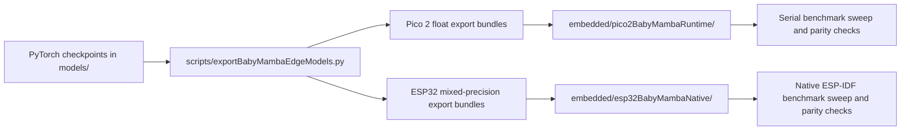

# BabyMamba Edge Deployment:

## Purpose:

This document records the edge deployment pipeline used for the BabyMamba-HAR study and replaces the earlier shorter workflow note. The aim is to document, in a reproducible and inspection-friendly form, how the BabyMamba PyTorch checkpoints were translated into deployable microcontroller inference bundles for Raspberry Pi Pico 2 and classic ESP32 targets.

The deployment path was intentionally not built around ONNX or TFLite. Instead, a runtime-free recurrent engine was emitted directly from the trained PyTorch checkpoints. This choice was made because the selective state space recurrence, the weight-tied bidirectional scan, and the channel-independent repeated-scan path were more faithfully preserved when exported as handwritten C and C++ structures rather than forced through a general graph compiler.

## Reference Basis:

The deployment methodology documented here was informed by two external reference points.

- The MambaLite-Micro repository: [Whiten-Rock/MambaLite-Micro](https://github.com/Whiten-Rock/MambaLite-Micro).
- The MambaLite-Micro paper: [MambaLite-Micro: Memory-Optimized Mamba Inference on MCUs](https://arxiv.org/abs/2509.05488).

Those references motivated the general runtime-free deployment philosophy. The implementation in this repository should, however, be understood as an adaptation for BabyMamba-HAR rather than as a verbatim reuse of an upstream codebase.

## Relationship To MambaLite-Micro:

The implementation in this repository was inspired by the deployment philosophy described by MambaLite-Micro, namely:

- trained PyTorch weights are exported into a lightweight embedded representation.
- the selective state space recurrence is executed by a handcrafted runtime rather than by a heavyweight operator framework.
- memory pressure is reduced by eliminating unnecessary intermediate graph tensors.

In the present repository, that philosophy was adapted to BabyMamba-HAR rather than copied as a one-to-one port. The adaptation was necessary because the repository contains two HAR-specific model families with architectural details that are not covered by a minimal single-variant Mamba runtime.

The most important adaptations were as follows.

- The `CrossoverBiDirBabyMambaHar` family required a weight-tied forward and reverse scan layout.
- The `CiBabyMambaHar` family required repeated channel-wise execution followed by feature accumulation and head fusion.
- The ESP32 study required mixed-precision projection storage, while the recurrent hidden state had to remain in `float32`.
- The corrected PyTorch fallback scan semantics had to be preserved for the channel-independent checkpoints that were trained without the fused `mamba-ssm` CUDA kernels.

The resulting edge path may therefore be described as a MambaLite-Micro style deployment strategy specialized for BabyMamba-HAR.

## Implementation Scope:

The committed deployment workflow covers the following artifact classes.

- Seed-aligned BabyMamba checkpoints under `models/`.
- Pico 2 export bundles under `Pico2Models/`.
- Native ESP32 export bundles under `ESP32Models/`.
- Export and measurement programs under `scripts/`.
- Handcrafted inference runtimes under `embedded/`.
- Measured hardware summaries in JSON and Markdown form.

The relevant committed programs are already present in the repository. They were not left as untracked local tooling. The main files are:

- `scripts/exportBabyMambaEdgeModels.py`.
- `scripts/exportBabyMambaPico2Models.py`.
- `scripts/exportBabyMambaEsp32Models.py`.
- `scripts/runBabyMambaPico2Sweep.py`.
- `scripts/runBabyMambaEsp32Sweep.py`.
- `embedded/pico2BabyMambaRuntime/babyMambaEngine.h`.
- `embedded/pico2BabyMambaRuntime/babyMambaPico2Runtime.ino`.
- `embedded/esp32BabyMambaNative/main/babyMambaEngine.h`.
- `embedded/esp32BabyMambaNative/main/babyMambaEngineWorker.h`.
- `embedded/esp32BabyMambaNative/main/main.cpp`.

## Deployment Design Rationale:

The BabyMamba families differ from the classical baselines in an important way. Their core temporal operator is a selective state space recurrence rather than a conventional CNN-LSTM or transformer attention stack. In practice, three consequences followed.

First, a direct graph export was found to be an awkward fit for the recurrent state update. Second, numerical parity was better preserved when the state update was expressed directly in C and C++. Third, hardware-specific optimization could be introduced exactly where it mattered most, namely in the projection-heavy linear stages and in the repeated per-channel execution path of the channel-independent model.

## End-To-End Workflow:

The final workflow is organized into four deterministic stages.

1. The BabyMamba checkpoints are selected from the committed checkpoint zoo.
2. A dataset-specific fixture sample and reference logits are generated in Python.
3. The trained parameters are serialized into `babyMambaWeights.h`.
4. The target runtime is compiled and flashed.
5. Latency, scratch memory, flash footprint, and parity are recorded on the device.

## Checkpoint Selection:

The export path begins in `scripts/exportBabyMambaEdgeModels.py`. Two BabyMamba families are supported.

- `crossoverBiDirBabyMambaHar`.
- `ciBabyMambaHar`.

For the crossover family, a validated dataset-specific checkpoint is selected from the committed model zoo or from the training results directory if a zoo copy is not yet present. For the channel-independent family, the export logic prioritizes the paper-aligned `fixed_seed29` checkpoint set and falls back to older runs only when explicitly needed.

This selection policy mattered because earlier smoke checkpoints existed in the workspace, and those older checkpoints were not always the canonical paper-aligned models.

## What Is Exported:

Each export bundle is centered around a generated `babyMambaWeights.h` file. That header contains:

- compile-time dimensions such as sequence length, channel count, and class count.
- class names and dataset display metadata.
- one verification fixture sample.
- PyTorch reference logits.
- desktop runtime logits.
- layer-wise parameter arrays for stems, patching, selective scan blocks, attention pooling, and the classification head.
- compile-time flags describing the scan implementation and projection storage format.

The export bundle also includes a manifest that records the dataset, variant, seed, parity numbers, and storage mode used for the projections.

## PyTorch-To-Embedded Translation:

The PyTorch model is not quantized as a monolithic graph. Instead, the layer parameters are unpacked into semantically meaningful groups and written into the C header in the same order in which the runtime consumes them. This is important because it avoids implicit operator reordering and preserves the exact recurrence structure used by the model.

For each recurrent layer, the following groups are emitted.

- pre-normalization weights and biases.
- post-normalization weights and biases.
- `A_log` and `D` recurrence parameters.
- input projection matrices.
- depthwise temporal convolution weights and biases.
- `x_proj` matrices.
- `dt_proj` weights and biases.
- output projection matrices.

The patching stem, pooling head, and classification head are exported in the same spirit. This direct structural export is one of the main reasons the on-device parity remained high.

## How Quantization Was Applied:

The BabyMamba deployment path uses two different numeric strategies depending on the device class.

### Pico 2 Path:

The Pico 2 deployment path preserves the BabyMamba recurrence in a float export. This path should not be read as a TFLite-style `FP32` versus `INT8` study. The deployed model is a handwritten recurrent program whose tensors are exported directly from PyTorch into C arrays and executed in place.

This choice was made because:

- the Pico 2 path already fit comfortably with the handcrafted recurrent runtime.
- parity was already high after the scan semantics were corrected.
- the recurrent state update was more important to preserve than to compress aggressively.

### ESP32 Path:

The native ESP32 deployment path uses mixed precision. Projection-heavy matrices are quantized row-wise to signed `INT8`, while hidden-state evolution, normalization, gating, selective scan accumulation, and output fusion remain in `float32`.

This policy was implemented because the projection matrices dominate memory traffic, while the recurrence itself is more sensitive to quantization noise. A full `INT8` state update was therefore not adopted.

The quantization logic is implemented in `scripts/exportBabyMambaEdgeModels.py` through the row-wise helper `quantize_rows_int8`. The following procedure is used.

1. Each matrix row is treated independently.
2. The maximum absolute value of that row is measured.
3. A per-row scale is computed from that maximum.
4. The row values are quantized into signed `INT8` coefficients in the `[-127, 127]` range.
5. The quantized row and its `float32` scale are emitted together into the generated header.

This row-wise scheme was used for:

- `kPatchPointwise`.
- per-layer `InProj`.
- per-layer `XProj`.
- per-layer `DtProjWeight`.
- per-layer `OutProj`.
- `kGatedProjectionWeight` in the channel-independent model.
- `kHeadLinearWeight`.

The recurrence-specific parameters such as `A_log`, `D`, convolution kernels, biases, hidden states, and normalization paths were intentionally left in `float32`.

## Why Mixed Precision Was Chosen:

The BabyMamba recurrence is numerically more fragile than the large projection matrices. It was therefore found to be more effective to compress the matrix-heavy front and back ends while leaving the recurrent hidden state untouched in `float32`.

The mixed-precision choice can be summarized as follows.

- Flash and memory traffic were reduced where the largest dense matrices appear.
- Numerical fidelity was protected where repeated recursive accumulation occurs.
- The implementation remained simple enough to inspect and debug at the C++ level.

This is a more selective strategy than generic post-training quantization. In that sense, the deployment path contains a practical methodological novelty inside this repository: quantization was applied only to the projection substructure of the BabyMamba block, while the SSM state update remained a floating-point recurrence.

## How MambaLite-Micro Was Modified In Practice:

The repository does not vendor the upstream MambaLite-Micro project as a drop-in submodule. Instead, its guiding ideas were adapted and extended. The practical modifications introduced here are listed below.

- A HAR-specific export schema was defined so that dataset metadata, fixture samples, and reference logits travel with the weight bundle.
- A weight-tied bidirectional runtime path was added for `CrossoverBiDirBabyMambaHar`.
- A channel-independent repeated-scan runtime path was added for `CiBabyMambaHar`.
- A corrected fallback scan mode was preserved through the `BABYMAMBA_SCAN_IMPL_FALLBACK` flag so that checkpoints trained without fused `mamba-ssm` kernels would still match PyTorch.
- A fast exponential lookup-table path was introduced for embedded nonlinear routines.
- Projection-only row-wise `INT8` storage with per-row scales was introduced for the native ESP32 path.
- A dual-core execution path was introduced on classic ESP32 for the channel-independent model so that the repeated per-channel workload could be split across both cores.

These changes are not superficial packaging changes. They altered the inference layout, the export manifest, the quantization boundary, and the hardware execution plan.

## The Corrected Channel-Independent Scan:

One technically important issue arose for the channel-independent checkpoints. Some of those checkpoints were trained through the pure PyTorch fallback selective scan rather than through the fused `mamba-ssm` kernels. That fallback implementation did not behave like a trivial one-step sequential recurrence in every detail. If the embedded runtime had ignored that distinction, parity would have degraded for datasets such as MotionSense and WISDM.

To address that, the export path records whether the checkpoint should use the corrected fallback chunked scan. The generated headers therefore include `BABYMAMBA_SCAN_IMPL_FALLBACK`, and the runtime follows the matching path rather than assuming a single universal scan implementation.

This correction was one of the most practically important parity fixes in the BabyMamba deployment study.

## Pico 2 Runtime:

The Pico 2 runtime is implemented in `embedded/pico2BabyMambaRuntime/`. The recurrence is executed directly in C++, and no TFLite or ONNX dependency is introduced.

The key characteristics of that runtime are:

- direct recurrence execution from exported weights.
- a fast exponential lookup table for nonlinear subroutines.
- explicit scratch-buffer management.
- deterministic serial benchmarking with fixture parity checks.

The BabyMamba Pico 2 path should therefore be understood as a native recurrent deployment, not as a graph-runtime deployment.

## Native ESP32 Runtime:

The native ESP32 runtime is implemented in `embedded/esp32BabyMambaNative/` and built with ESP-IDF. The runtime consumes the same logical export representation, but it adds hardware-conscious optimization layers.

The main changes on ESP32 are:

- row-wise `INT8` projection storage with `float32` per-row scales.
- a quantized row dot-product helper in `babyMambaEngine.h`.
- a dual-core split for the channel-independent family in `main.cpp` and `babyMambaEngineWorker.h`.
- preservation of `float32` recurrence, normalization, and gating.

The resulting system is still a handcrafted runtime-free BabyMamba deployment engine, but it is more aggressively optimized than the Pico 2 version because the ESP32 study was used to pursue lower latency as well as deployability.

## Quantized Header Layout:

When `--projection-format int8` is selected, the generated header enables `BABYMAMBA_USE_INT8_PROJECTIONS`. The runtime then switches from plain `float` matrix access to the quantized row path. For each projection matrix, two companion arrays are emitted:

- an `INT8` matrix carrying the row coefficients.
- a `float32` scale vector carrying one scale per output row.

At inference time, the dot product is accumulated in `float32`, and the row scale is applied once at the end. In this way, storage is compressed without converting the entire recurrent engine into a fully quantized program.

## Measurement And Verification:

Every export bundle includes a fixture sample, a PyTorch reference logit vector, and a desktop engine logit vector. Those references were used during board benchmarking to calculate:

- parity versus PyTorch.
- parity versus the desktop export engine.
- maximum absolute logit error.
- top-1 label agreement.

This design made it possible to separate model-export errors from board-runtime errors. It also ensured that parity issues could be traced to either the export path or the device path rather than being treated as an opaque hardware mismatch.

## Repository-Specific Novelty:

The novelty that can be claimed responsibly within this repository is not that BabyMamba is the first state space model ever deployed on a microcontroller. A stronger and more defensible statement is the following.

The repository contributes a BabyMamba-specific adaptation of a MambaLite-Micro style deployment methodology, with three practical distinctions.

- A weight-tied bidirectional selective scan path was exported and executed directly on microcontrollers.
- A channel-independent repeated-scan BabyMamba family was made reproducible on-device, including the corrected fallback scan semantics needed for parity preservation.
- A mixed-precision projection-only quantization strategy was applied on classic ESP32, while the recurrent state update remained in `float32`.

Within the scope of this repository, these are the methodological points that are most worth highlighting.

## File Map For Reproducibility:

The main implementation files should be read in the following order.

- `scripts/exportBabyMambaEdgeModels.py`. Core export and quantization logic.
- `scripts/exportBabyMambaPico2Models.py`. Pico 2 bundle generation wrapper.
- `scripts/exportBabyMambaEsp32Models.py`. ESP32 bundle generation wrapper.
- `scripts/runBabyMambaPico2Sweep.py`. Pico 2 flash and benchmark harness.
- `scripts/runBabyMambaEsp32Sweep.py`. Native ESP32 benchmark harness.
- `embedded/pico2BabyMambaRuntime/babyMambaEngine.h`. Pico 2 recurrent engine.
- `embedded/esp32BabyMambaNative/main/babyMambaEngine.h`. Main ESP32 recurrent engine.
- `embedded/esp32BabyMambaNative/main/babyMambaEngineWorker.h`. Secondary-core worker engine for the CI variant.
- `embedded/esp32BabyMambaNative/main/main.cpp`. Native benchmark entry point and dual-core orchestration.

## Practical Conclusion:

The BabyMamba deployment path in this repository should be viewed as a handcrafted recurrent compilation pipeline rather than as a conventional graph export. The selective state space blocks were translated into device-oriented C and C++ code, the PyTorch weights were re-encoded into compact embedded headers, and mixed precision was introduced only where it materially improved memory and latency without destabilizing the recurrence.

In that sense, the BabyMamba edge deployment study is methodologically closer to a specialized embedded systems implementation than to a generic model-conversion pipeline. That is precisely why the deployment artifacts in this repository are worth preserving in source form.
