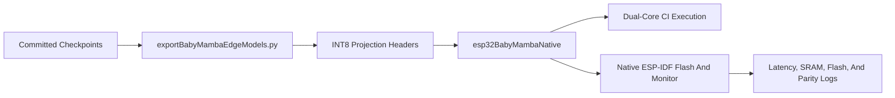

# ESP32 Deployment Results Report:

## Scope:

This report documents the measured BabyMamba-HAR deployment study on the classic ESP32 `ESP32-D0WD-V3` platform without PSRAM. The native ESP-IDF runtime was used for both BabyMamba variants. The selective state space recurrence was executed through handcrafted C++ code, and the projection-heavy matrices were exported with row-wise `INT8` storage and float scales. Hidden-state evolution, normalization, and the recurrent scan remained in `float32` so that parity with the PyTorch reference could be preserved.

The measured artifacts committed with this update are listed below.

- `ESP32Models/babyMambaEsp32Metrics.json`.
- `ESP32Models/babyMambaEsp32Metrics.md`.
- `ESP32Models/ciBabyMambaHar/`.
- `ESP32Models/crossoverBiDirBabyMambaHar/`.
- `ESP32Models/deviceRuns/`.
- `embedded/esp32BabyMambaNative/`.
- `scripts/runBabyMambaEsp32Sweep.py`.

## Native Runtime Path:

The present repository version carries the native ESP-IDF runtime rather than only an export scaffold. The deployment path was organized as a direct checkpoint-to-header export, followed by native compilation and on-device serial benchmarking.

The most important architectural decision was the separation between storage precision and recurrence precision. The projection matrices were compressed aggressively because they dominate flash traffic and repeated matvec cost. The recurrent state and scan path were left in `float32`, because these operations were found to be more sensitive to numerical drift on the classic ESP32 target.

## Optimization Summary:

The native ESP32 path was optimized in several stages. First, the channel-independent variant was split across both ESP32 cores. Second, the hot projection loops were tightened with fused dot-product helpers and a more cache-friendly patch-pointwise path. Third, the projection-heavy matrices were rewritten into row-wise `INT8` form with per-row float scales, and the native engine was updated to consume that representation directly.

This final repository state therefore reflects a measured optimization path rather than a paper-only export snapshot.

- Dual-core channel splitting was applied to `CiBabyMambaHar.`.
- `INT8` projection storage was applied to `inProj`, `xProj`, `dtProjWeight`, `outProj`, the patch pointwise projection, the gated attention projection, and the classifier head.
- `float32` recurrence and hidden state were retained to preserve parity.
- Native ESP-IDF `-O3` compilation was enabled in the active component build.

## Family-Level Summary:

The consolidated family averages are shown below.

| Variant | Successful Datasets | Average Latency (ms) | Average Parity vs PyTorch (%) | Flash Range (B) | Scratch Range (B) |
| --- | ---: | ---: | ---: | ---: | ---: |
| `CrossoverBiDirBabyMambaHar` | 8/8 | 154.442 | 99.201860 | 207936 to 285616 | 20516 to 33892 |
| `CiBabyMambaHar` | 8/8 | 2768.142 | 99.360693 | 220672 to 260512 | 47240 to 71944 |

These numbers should be interpreted carefully. The crossover family remained the practical low-latency option on classic ESP32. The channel-independent family remained much heavier because the recurrent backbone is executed independently for each sensor channel before pooling. Even so, the native `INT8` projection path reduced the average `CiBabyMambaHar` latency very substantially relative to the earlier float-only native runtime.

## Measured Variant Comparison:

The measured comparison between the two BabyMamba families is summarized below.

- `CrossoverBiDirBabyMambaHar` completed all `8` datasets with sub-`300 ms` latency on every dataset, and with parity remaining above `97%` on every run.
- `CiBabyMambaHar` also completed all `8` datasets, but latency scaled strongly with channel count, reaching the largest value on `Opportunity`.
- The `INT8` projection path reduced the average `CiBabyMambaHar` latency to `2768.142 ms`, while keeping average parity at `99.360693%`.
- The same optimization reduced the average `CrossoverBiDirBabyMambaHar` latency to `154.442 ms`, while keeping average parity at `99.201860%`.

## Per-Dataset Results:

### CrossoverBiDirBabyMambaHar:

| Dataset | Flash (B) | Scratch (B) | Heap Free Before (B) | Heap Used After (B) | Avg Latency (ms) | Parity vs PyTorch (%) | Predicted Label | Expected Label |
| --- | ---: | ---: | ---: | ---: | ---: | ---: | --- | --- |
| `ucihar` | 214112 | 33892 | 241084 | 41252 | 147.573013 | 99.701012 | Standing | Standing |
| `motionsense` | 211264 | 33892 | 241084 | 41252 | 154.563904 | 99.304688 | Standing | Downstairs |
| `wisdm` | 207936 | 33892 | 241084 | 41252 | 151.671310 | 99.598175 | Jogging | Jogging |
| `pamap2` | 224928 | 33892 | 241084 | 41252 | 154.131607 | 99.539238 | Standing | Lying |
| `opportunity` | 285616 | 33892 | 241084 | 41252 | 271.934509 | 99.162827 | Null | Null |
| `unimib` | 208320 | 33892 | 241084 | 41252 | 150.672302 | 99.186699 | Activity_0 | Activity_0 |
| `skoda` | 231536 | 27412 | 247564 | 41252 | 125.418709 | 97.202003 | Gesture_2 | Gesture_5 |
| `daphnet` | 209632 | 20516 | 254460 | 41252 | 79.573006 | 99.920235 | No Freeze | No Freeze |

### CiBabyMambaHar:

| Dataset | Flash (B) | Scratch (B) | Heap Free Before (B) | Heap Used After (B) | Avg Latency (ms) | Parity vs PyTorch (%) | Predicted Label | Expected Label |
| --- | ---: | ---: | ---: | ---: | ---: | ---: | --- | --- |
| `ucihar` | 225856 | 71944 | 201952 | 57988 | 4221.790527 | 98.977974 | Standing | Standing |
| `motionsense` | 224320 | 71944 | 201952 | 57988 | 2651.248535 | 99.267189 | Downstairs | Downstairs |
| `wisdm` | 222768 | 71944 | 201952 | 57988 | 1679.188477 | 99.749390 | Jogging | Jogging |
| `pamap2` | 230576 | 71944 | 201952 | 57988 | 1950.154053 | 99.564018 | Standing | Lying |
| `opportunity` | 260512 | 71944 | 201952 | 57988 | 8420.959961 | 99.450012 | Null | Null |
| `unimib` | 221984 | 71944 | 201952 | 57988 | 385.829315 | 98.813705 | Activity_0 | Activity_0 |
| `skoda` | 231616 | 59976 | 213920 | 57988 | 2344.808594 | 99.573967 | Gesture_5 | Gesture_5 |
| `daphnet` | 220672 | 47240 | 226588 | 57988 | 491.156036 | 99.489288 | No Freeze | No Freeze |

## Interpretation:

Several conclusions were supported by the measured data.

First, the classic ESP32 can run both BabyMamba families natively when the recurrence is implemented directly and the projection-heavy matrices are compressed appropriately. This is a meaningful result because it shows that the selective state space path does not require a graph compiler to remain deployable on a constrained microcontroller target.

Second, the crossover family remained the more deployment-friendly design for low-latency inference. The reason is structural rather than incidental. Its shared bidirectional recurrence is evaluated over the fused sensor representation once per inference, whereas the channel-independent family repeats the recurrent stack for each input channel before aggregation.

Third, the quantized projection path produced a strong speedup without materially damaging parity. The dominant flash and compute burden on the classic ESP32 was traced to the repeated projection matvecs. Once those matrices were stored in `INT8` form with per-row scales, latency fell sharply while the recurrent state path remained numerically stable in `float32`.

## Prediction Mismatch Notes:

A small number of fixtures still produced top-1 label flips despite high logit parity. These rows should not be confused with broad deployment failure. They are preserved because they matter for careful paper interpretation.

- `CrossoverBiDirBabyMambaHar / motionsense` predicted `Standing`, while the committed fixture label was `Downstairs`.
- `CrossoverBiDirBabyMambaHar / pamap2` predicted `Standing`, while the committed fixture label was `Lying`.
- `CrossoverBiDirBabyMambaHar / skoda` predicted `Gesture_2`, while the committed fixture label was `Gesture_5`.
- `CiBabyMambaHar / pamap2` predicted `Standing`, while the committed fixture label was `Lying`.

These cases still showed high parity against the PyTorch logits, which suggests that the decision boundary around the selected fixture remained very narrow rather than that the full runtime path had diverged catastrophically.

## Practical Conclusion:

The present repository release should be read as a completed native ESP32 deployment study rather than only as an export bundle release. The crossover family was established as the stronger latency-oriented deployment choice on classic ESP32. The channel-independent family was also shown to be feasible, although at much higher runtime cost. Most importantly, the mixed-precision deployment idea was validated in practice through `INT8` projection storage with `float32` recurrent state, and this optimization materially improved the usefulness of the classic ESP32 path.

For users who want to reproduce or extend the study, the recommended path is straightforward.

1. Use the committed model zoo under `models/`.
2. Regenerate headers with `scripts/exportBabyMambaEsp32Models.py`.
3. Build and flash `embedded/esp32BabyMambaNative/`.
4. Run `scripts/runBabyMambaEsp32Sweep.py` to collect fresh measurements.
