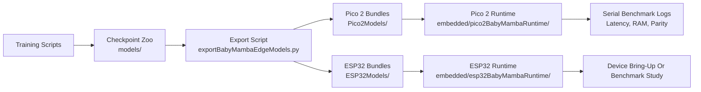

# Edge Deployment Workflow:

## Overview:

The BabyMamba-HAR deployment path is built around a handcrafted recurrent engine rather than a graph conversion stack. This choice was made because the selective state space recurrence is more faithfully preserved when the linear scan is emitted directly as C++ code. The resulting workflow is compact, inspectable, and well suited to resource-constrained microcontrollers.

## Deployment Stages:

The end-to-end process is organized into four reproducible stages.

1. Dataset-specific checkpoints are trained and saved.
2. The checkpoint weights are exported into embedded C headers.
3. A target-specific runtime is prepared for Pico 2 or ESP32.
4. Serial benchmarking is executed to record latency, memory, and parity.

## Workflow Diagram:

## Training Artifacts:

Two model families are preserved in the committed checkpoint zoo.

- `models/ciBabyMambaHar/`. Seed-29 CI-BabyMamba-HAR retraining outputs for all datasets.
- `models/crossoverBiDirBabyMambaHar/`. Validated crossover bidirectional checkpoints used in the deployment study.

Each dataset directory contains the deployable checkpoint and its run metadata. This structure was chosen so that export generation can be repeated without rediscovering the original training workspace.

## Export Representation:

The export step is implemented in `scripts/exportBabyMambaEdgeModels.py`. The generated `babyMambaWeights.h` file contains the following components.

- Model dimensions and compile-time constants.
- Weight arrays for each recurrent layer.
- Class names and dataset identifiers.
- A fixture input sample.
- Reference logits from PyTorch and from the desktop export engine.

For the crossover bidirectional family, the recurrent layout reflects the weight-tied forward and reverse scan used in the model. For the channel-independent family, the export path preserves the corrected fallback chunked selective scan that was required for high parity on MotionSense and WISDM.

## Pico 2 Runtime:

The Pico 2 runtime is stored in `embedded/pico2BabyMambaRuntime/`. The recurrent step is executed directly in C++, and no TFLite or ONNX dependency is introduced. This path was used for the measured deployment results committed in `Pico2Models/babymamba_pico2_metrics.json`.

The most important practical outcome is that both BabyMamba families were demonstrated on the Pico 2 with very high parity. The crossover family was found to be especially attractive for low-latency deployment.

## ESP32 Runtime:

The ESP32 runtime scaffold is stored in `embedded/esp32BabyMambaRuntime/`. The same exported header format is used, so the deployment representation remains consistent across targets. The committed `ESP32Models/` directory therefore serves as a portable model bundle store for future ESP32-specific runtime studies.

The present repository snapshot should be interpreted carefully here. Device bundles are committed, but a full BabyMamba ESP32 benchmark table is not claimed in this repository release.

## Reproducibility Notes:

The committed model and export folders were included so that the edge study remains inspectable and reusable. The following principles were followed.

- Checkpoints were preserved alongside their run summaries.
- Generated headers were committed under device-specific folders.
- Measured Pico 2 results were committed as JSON and Markdown.
- The deployment code was kept human-readable and device-oriented.
