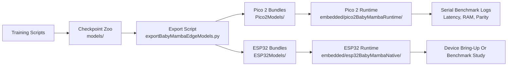

# Edge Deployment Workflow:

## Overview:

The BabyMamba-HAR deployment path is built around a handcrafted recurrent engine rather than a graph conversion stack. This choice was made because the selective state space recurrence is more faithfully preserved when the linear scan is emitted directly as C++ code. The resulting workflow is compact, inspectable, and well suited to resource-constrained microcontrollers.

## Deployment Stages:

The end-to-end process is organized into four reproducible stages.

1. Dataset-specific checkpoints are trained and saved.
2. The checkpoint weights are exported into embedded C headers.
3. A target-specific runtime is prepared for Pico 2 or ESP32.
4. Serial benchmarking is executed to record latency, memory, and parity.

## Workflow Diagram:

## Training Artifacts:

Two model families are preserved in the committed checkpoint zoo.

- `models/ciBabyMambaHar/`. Seed-29 CI-BabyMamba-HAR retraining outputs for all datasets.
- `models/crossoverBiDirBabyMambaHar/`. Validated crossover bidirectional checkpoints used in the deployment study.

Each dataset directory contains the deployable checkpoint and its run metadata. This structure was chosen so that export generation can be repeated without rediscovering the original training workspace.

The comparison-model assets are preserved in parallel under `models/baselines/`. Seed-29 checkpoints and deployment summaries are therefore available for `TinyHAR`, `TinierHAR`, and `DeepConvLSTM` without mixing the BabyMamba and baseline studies together.

## Export Representation:

The export step is implemented in `scripts/exportBabyMambaEdgeModels.py`. The generated `babyMambaWeights.h` file contains the following components.

- Model dimensions and compile-time constants.
- Weight arrays for each recurrent layer.
- Class names and dataset identifiers.
- A fixture input sample.
- Reference logits from PyTorch and from the desktop export engine.

For the crossover bidirectional family, the recurrent layout reflects the weight-tied forward and reverse scan used in the model. For the channel-independent family, the export path preserves the corrected fallback chunked selective scan that was required for high parity on MotionSense and WISDM.

## Pico 2 Runtime:

The Pico 2 runtime is stored in `embedded/pico2BabyMambaRuntime/`. The recurrent step is executed directly in C++, and no TFLite or ONNX dependency is introduced. This path was used for the measured deployment results committed in `Pico2Models/babymamba_pico2_metrics.json`.

The most important practical outcome is that both BabyMamba families were demonstrated on the Pico 2 with very high parity. The crossover family was found to be especially attractive for low-latency deployment.

The Pico 2 bundles should be read carefully in methodological terms. They are not a separate `FP32` versus `INT8` graph-compilation study. The exported headers preserve the handcrafted recurrent inference path directly, and the board-level behavior is therefore governed by the emitted selective state space code rather than by a microcontroller graph runtime.

## ESP32 Runtime:

The native ESP32 runtime is stored in `embedded/esp32BabyMambaNative/`. This path was built with ESP-IDF and was used for the measured classic ESP32 study committed in `ESP32Models/babyMambaEsp32Metrics.json`. The recurrent scan is executed directly in C++, while the projection-heavy matrices are stored with row-wise `INT8` compression and float scales.

The earlier Arduino-oriented scaffold is still preserved in `embedded/esp32BabyMambaRuntime/` for continuity, but the measured deployment path in this repository release is the native ESP-IDF runtime.

The most important practical outcome is that both BabyMamba families were demonstrated on a classic no-PSRAM ESP32. The crossover family remained the stronger low-latency deployment choice, while the channel-independent family remained feasible after the projection path was compressed and the channel loop was split across both cores.

## Baseline Deployment Record:

The repository also contains the committed baseline deployment bundles and sanitized hardware summaries.

- `Pico2Models/baselines/`. Preserved Pico 2 baseline bundles and the Pico 2 summary JSON.
- `ESP32Models/baselines/`. Preserved ESP32 baseline bundles and the ESP32 summary JSON.
- `docs/BaselineDeploymentResultsReport.md`. Consolidated interpretation of the baseline edge study.

This separation was kept deliberately. The BabyMamba families rely on the handcrafted recurrent export path, whereas the preserved classical baselines are carried as comparison artifacts and should be read as supporting evidence in the broader edge study.

The preserved baseline bundles were refreshed after the activation-quantization collapse cases were re-exported with a repaired mixed quantized path. For the affected `TinyHAR` and `TinierHAR` bundles, `int16` activations with `int8` weights were promoted when they produced substantially higher parity than the earlier full `int8` exports. The updated manifests therefore distinguish between the legacy full-`int8` sidecars and the promoted canonical quantized bundle used in the refreshed deployment summaries.

## Reproducibility Notes:

The committed model and export folders were included so that the edge study remains inspectable and reusable. The following principles were followed.

- Checkpoints were preserved alongside their run summaries.
- Generated headers were committed under device-specific folders.
- Measured Pico 2 results were committed as JSON and Markdown.
- Measured native ESP32 results were committed as JSON and Markdown.
- The deployment code was kept human-readable and device-oriented.
